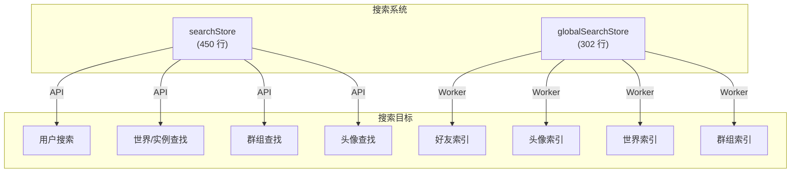

# 搜索与直接访问

## 概述

VRCX 有两个搜索系统：**Search Store** 用于 VRC API 驱动的搜索和直接实体访问，**Global Search Store** 用于通过 Web Worker 在本地索引数据上进行客户端模糊搜索。

## 快速搜索

顶栏搜索组件使用快速搜索进行即时好友查找：

- 使用 `Intl.Collator` 进行区域感知的大小写不敏感比较
- 查询为空时回退到用户历史（最近查看的 5 个用户）
- 在结果末尾添加"搜索..."选项
- 混淆字符移除（`removeConfusables`）规范化 Unicode 相似字符
- 匹配字段：清理后的显示名、原始显示名、用户备忘录、用户备注
- 排序：前缀匹配优先，上限 4 个结果

## 直接访问解析器

`directAccessParse(input)` 是一个通用实体解析器，解析各种输入格式：

| 输入格式 | 实体 | 示例 |
|---------|------|------|
| `usr_xxxx` | 用户 | `usr_12345678-abcd-...` |
| `avtr_xxxx` / `b_xxxx` | 头像 | `avtr_12345678-abcd-...` |
| `wrld_xxxx` / `wld_xxxx` / `o_xxxx` | 世界 | `wrld_12345678-abcd-...` |
| `grp_xxxx` | 群组 | `grp_12345678-abcd-...` |
| `XXX.0000`（短代码） | 群组 | `ABC.1234` |
| VRChat URL | 用户/世界/头像/群组 | `https://vrchat.com/home/...` |
| `https://vrc.group/XXX.0000` | 群组 | 短群组 URL |
| `https://vrch.at/XXXXXXXX` | 实例 | 短实例 URL |
| `XXXXXXXX`（8 字符） | 实例 | 短名称 |

### 直接访问粘贴

`directAccessPaste()` 从剪贴板读取（平台感知：Electron vs CEF），尝试解析，如果解析失败则回退到全能访问对话框。

## 全局搜索 Store

使用专用 Web Worker 避免阻塞 UI 线程：
1. **索引构建：** 登录时将所有好友、头像、世界和群组发送给 worker 进行索引
2. **搜索执行：** 查询发送给 worker，返回排名结果
3. **重新索引：** 在数据变更时触发（新好友、更新的收藏等）

| 分类 | 数据源 | 索引字段 |
|------|--------|---------|
| 好友 | `friendStore.friends` | displayName、memo、note |
| 头像 | `avatarStore` + `favoriteStore` | name、authorName |
| 世界 | `favoriteStore` | name、authorName |
| 群组 | `groupStore.currentUserGroups` | name、shortCode |

## 文件映射

| 文件 | 行数 | 用途 |
|------|------|------|
| `stores/search.js` | 450 | 快速搜索、直接访问、用户搜索 API |
| `stores/globalSearch.js` | 302 | Worker 驱动的全局模糊搜索 |

## 风险与注意事项

- **快速搜索在每次按键时遍历所有好友**（有防抖）。对于 5000+ 好友的用户可能有明显延迟。
- **直接访问解析**使用正则和字符串前缀匹配 — 一些格式错误的 URL 边缘情况可能无法正确解析。
- **搜索 worker** 在内存中持有所有索引数据的完整副本。这会使好友数据的内存使用翻倍。
