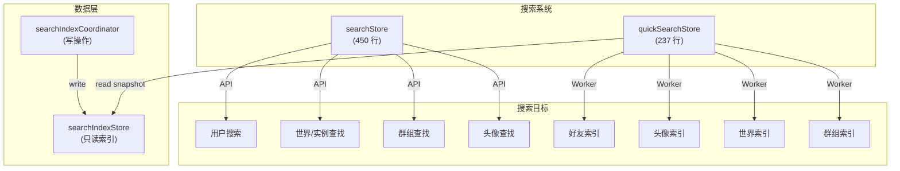
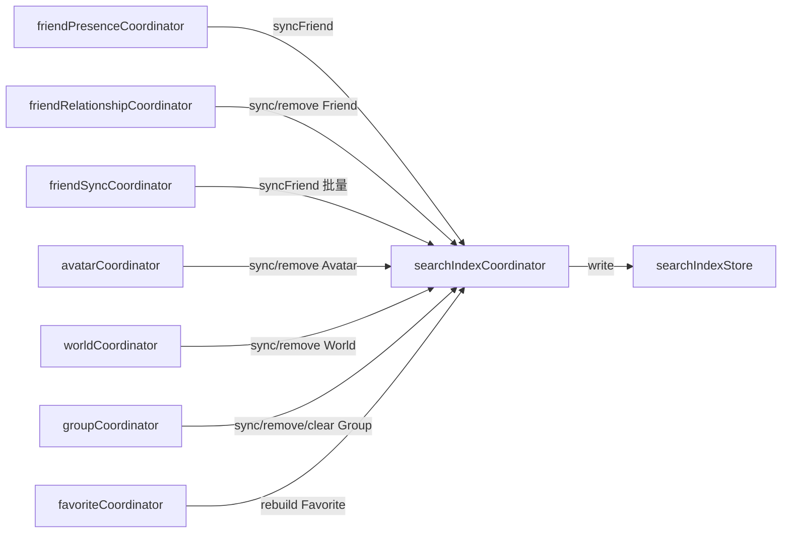
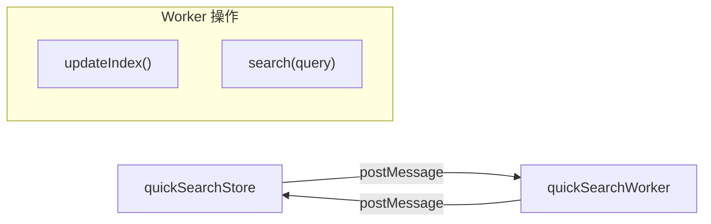

# 搜索与直接访问

## 概述

VRCX 有两个搜索系统：**Search Store** 用于 VRC API 驱动的搜索和直接实体访问，**Quick Search** 用于通过 Web Worker 在本地索引数据上进行客户端模糊搜索。

## 快速搜索

顶栏搜索组件使用快速搜索进行即时好友查找：

- 使用 `Intl.Collator` 进行区域感知的大小写不敏感比较
- 查询为空时回退到用户历史（最近查看的 5 个用户）
- 在结果末尾添加"搜索..."选项
- 混淆字符移除（`removeConfusables`）规范化 Unicode 相似字符
- 匹配字段：清理后的显示名、原始显示名、用户备忘录、用户备注
- 排序：前缀匹配优先，上限 4 个结果

## 直接访问解析器

`directAccessParse(input)` 是一个通用实体解析器，解析各种输入格式：

| 输入格式 | 实体 | 示例 |
|---------|------|------|
| `usr_xxxx` | 用户 | `usr_12345678-abcd-...` |
| `avtr_xxxx` / `b_xxxx` | 头像 | `avtr_12345678-abcd-...` |
| `wrld_xxxx` / `wld_xxxx` / `o_xxxx` | 世界 | `wrld_12345678-abcd-...` |
| `grp_xxxx` | 群组 | `grp_12345678-abcd-...` |
| `XXX.0000`（短代码） | 群组 | `ABC.1234` |
| VRChat URL | 用户/世界/头像/群组 | `https://vrchat.com/home/...` |
| `https://vrc.group/XXX.0000` | 群组 | 短群组 URL |
| `https://vrch.at/XXXXXXXX` | 实例 | 短实例 URL |
| `XXXXXXXX`（8 字符） | 实例 | 短名称 |

### 直接访问粘贴

`directAccessPaste()` 从剪贴板读取（平台感知：Electron vs CEF），尝试解析，如果解析失败则回退到全能访问对话框。

## 搜索索引架构

### 三层分离

搜索索引使用严格的三层架构：

1. **`searchIndexStore`** — 纯数据容器，持有索引的好友、头像、世界、群组和收藏。对外暴露只读的 `getSnapshot()`（供 Worker 使用）和 `version` 计数器（变更追踪）。
2. **`searchIndexCoordinator`** — 所有搜索索引变更的**唯一写入口**。其他 coordinator、store 和 view 不得直接调用 `useSearchIndexStore()` 进行写操作。
3. **`quickSearchStore`** — 通过 `getSnapshot()` 只读消费索引，将数据发送到 Web Worker 进行离线搜索。

### searchIndexCoordinator API

| 函数 | 用途 |
|------|------|
| `syncFriendSearchIndex(ctx)` | 好友写入索引 |
| `removeFriendSearchIndex(id)` | 从索引移除好友 |
| `clearFriendSearchIndex()` | 清空所有好友 |
| `syncAvatarSearchIndex(ref)` | 头像写入索引 |
| `removeAvatarSearchIndex(id)` | 从索引移除头像 |
| `clearAvatarSearchIndex()` | 清空所有头像 |
| `syncWorldSearchIndex(ref)` | 世界写入索引 |
| `removeWorldSearchIndex(id)` | 从索引移除世界 |
| `clearWorldSearchIndex()` | 清空所有世界 |
| `syncGroupSearchIndex(ref)` | 群组写入索引 |
| `removeGroupSearchIndex(id)` | 从索引移除群组 |
| `clearGroupSearchIndex()` | 清空所有群组 |
| `rebuildFavoriteSearchIndex()` | 从 store 重建收藏索引 |
| `clearFavoriteSearchIndex()` | 清空所有收藏 |
| `resetSearchIndexOnLogin()` | 监听 `isLoggedIn`，切换时清空全部 |

### 写入调用链

## Quick Search Store (`quickSearchStore`)

### Web Worker 架构

使用专用 Web Worker 避免阻塞 UI 线程：

1. **索引快照：** 对话框打开时，通过 `searchIndexStore.getSnapshot()` 发送完整数据快照到 Worker
2. **搜索执行：** 查询发送给 Worker，返回排名结果
3. **重新索引：** 在 `searchIndexStore.version` 变化且对话框处于打开状态时响应式触发

### 搜索分类

| 分类 | 数据源 | 索引字段 |
|------|--------|---------|
| 好友 | `friendStore.friends` | displayName、memo、note |
| 自己的头像 | `avatarStore`（按 authorId 过滤） | name |
| 收藏头像 | `favoriteStore` | name |
| 自己的世界 | `worldStore`（按 authorId 过滤） | name |
| 收藏世界 | `favoriteStore` | name |
| 自己的群组 | `groupStore`（按 ownerId 过滤） | name |
| 加入的群组 | `groupStore.currentUserGroups` | name |

## 文件映射

| 文件 | 行数 | 用途 |
|------|------|------|
| `stores/search.js` | 450 | 快速搜索、直接访问、用户搜索 API |
| `stores/searchIndex.js` | ~260 | 搜索索引数据容器 |
| `stores/quickSearch.js` | 237 | Worker 驱动的快速搜索编排 |
| `stores/quickSearchWorker.js` | 373 | Web Worker：混淆字符处理、区域搜索 |
| `coordinators/searchIndexCoordinator.js` | 107 | 集中化的搜索索引写操作 |

## 风险与注意事项

- **快速搜索在每次按键时遍历所有好友**（有防抖）。对于 5000+ 好友的用户可能有明显延迟。
- **直接访问解析**使用正则和字符串前缀匹配 — 一些格式错误的 URL 边缘情况可能无法正确解析。
- **搜索 Worker** 在内存中持有所有索引数据的完整副本。这会使好友数据的内存使用翻倍。
- **已知架构妥协**：`friend.js` 和 `user.js` 仍然直接 import `searchIndexCoordinator`（store → coordinator 反向依赖），用于异步 memo/note 加载回调。
