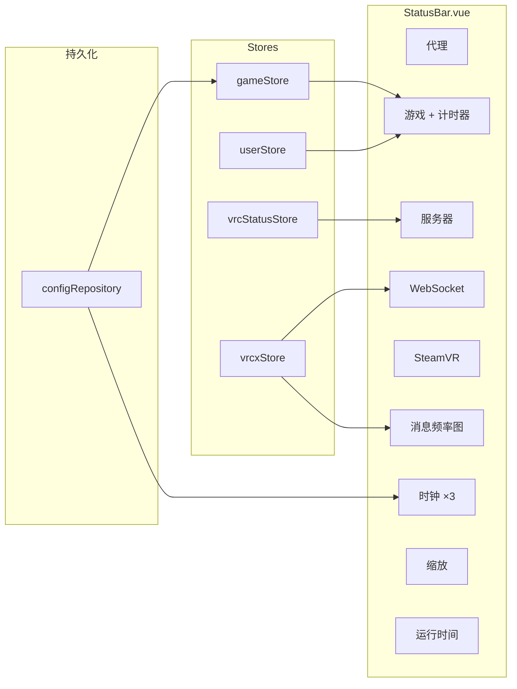
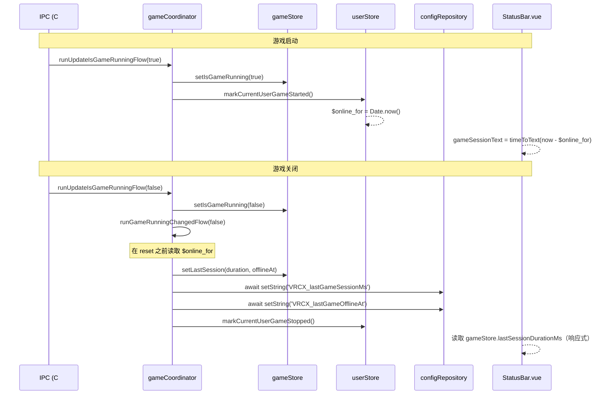

# 状态栏

## 当前状态: ✅ 已实现 (2026-03-13)

## 概述

状态栏是应用底部固定的 22px 条带，提供系统状态一览、游戏计时、可配置时区时钟等功能。



## 指示器

| 指示器 | 数据源 | 交互方式 |
|--------|--------|----------|
| **代理** | `generalSettingsStore.proxyEnabled` | Tooltip |
| **游戏** | `gameStore.isGameRunning` + `userStore.currentUser.$online_for` | HoverCard（会话详情） |
| **服务器** | `vrcStatusStore.hasIssue` + `incidents` | HoverCard（事件列表） |
| **WebSocket** | `vrcxStore.wsConnected` | Tooltip |
| **SteamVR** | `gameStore.isSteamVRRunning` | Tooltip |
| **消息频率图** | `vrcxStore.wsMessageRates` | Canvas 图表（msg/min） |
| **时钟** | `dayjs` + UTC 偏移配置 | 点击配置 |
| **缩放** | `generalSettingsStore.zoomLevel` | 数字输入框 ± 按钮 |
| **运行时间** | `vrcxStore.startTime` | Tooltip |

所有指示器可通过右键菜单切换显隐。显隐状态持久化到 `configRepository`，key 为 `VRCX_statusBarVisibility`。

## 游戏计时器

### 功能概要

- **运行中**：在 "Game" 标签旁显示实时时长（如 `1h 30m`，不含秒）
- **运行中 + Hover**：HoverCard 显示启动时间（`MM/DD HH:mm`）和精确时长含秒（`1h 30m 25s`）
- **停止 + Hover**：HoverCard 显示上次 session 时长和离线时间（`MM/DD HH:mm`）
- **无历史**：没有上次 session 记录时不显示 HoverCard

### 数据流



### 关键设计决策

1. **Store 优先、DB 其次**：Session 数据通过 `setLastSession()` 同步写入 `gameStore`，然后再 `await` 持久化到 `configRepository`。这避免了 StatusBar 的 watch 在 DB 写入完成前触发导致的读写竞争问题。

2. **$online_for 的读取时机**：在 `gameCoordinator` 中于调用 `markCurrentUserGameStopped()`（会将其重置为 `0`）*之前*读取 session 开始时间戳。

3. **启动恢复**：`gameStore.init()` 从 `configRepository` 加载持久化的 session 数据，确保上次 session 信息在应用重启后仍可用。

### 持久化 Key

| Key | 类型 | 用途 |
|-----|------|------|
| `VRCX_lastGameSessionMs` | String (数字) | 上次游戏 session 时长（毫秒） |
| `VRCX_lastGameOfflineAt` | String (数字) | 上次游戏 session 结束时间戳 |

## 字体策略

状态栏使用 `fonts.css` 中定义的自定义字体栈 `--font-mono-cjk`：

```css
--font-mono-cjk:
    ui-monospace, SFMono-Regular, Menlo, Monaco, Consolas,
    'Liberation Mono', 'Courier New',
    var(--font-primary-cjk), monospace;
```

- **ASCII 字符**：使用系统等宽字体（复古终端风格）
- **CJK 字符**：Fallback 到项目的 Noto Sans CJK 字体栈（`--font-primary-cjk`），通过 `:root[lang]` 选择器按语言自动排列优先级

这确保了状态栏在所有 14 种支持的语言下都能正常显示。

## 时钟系统

最多 3 个可配置时区时钟，每个包含：
- UTC 偏移量（-12 到 +14，支持 0.5 小时增量）
- 显示格式：`HH:mm UTC±N`

配置存储在 `configRepository`：
- `VRCX_statusBarClocks` — 3 个时钟配置的 JSON 数组
- `VRCX_statusBarClockCount` — 可见时钟数量（0–3）

## 平台兼容性

| 功能 | Windows (CEF) | macOS (Electron) |
|------|:---:|:---:|
| 代理指示器 | ✅ | ❌（AppApi 不可用） |
| 游戏指示器 | ✅ | ❌ |
| SteamVR 指示器 | ✅ | ❌ |
| 服务器、WS、频率图、时钟、缩放、运行时间 | ✅ | ✅ |

## i18n Key

所有状态栏字符串在本地化文件的 `status_bar` 命名空间下：

| Key | EN 值 | 用途 |
|-----|-------|------|
| `game` | Game | 标签 |
| `game_running` | VRChat is running | — |
| `game_stopped` | VRChat is not running | — |
| `game_started_at` | Started | Hover：游戏启动时间 |
| `game_session_duration` | Duration | Hover：精确 session 时长 |
| `game_last_session` | Last Session | Hover：上次 session 时长 |
| `game_last_offline` | Offline Since | Hover：上次离线时间 |
