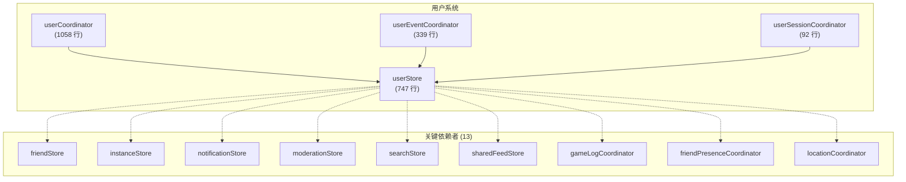
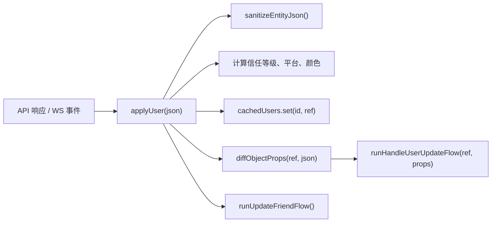
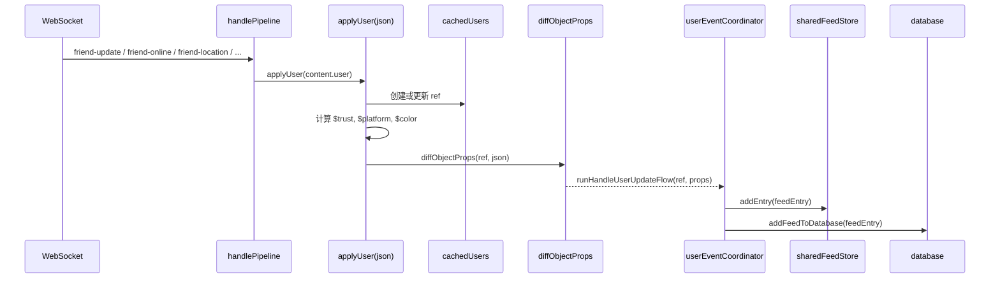

# 用户系统

用户系统是 VRCX 数据模型的**核心枢纽**。它管理当前用户状态、所有已知用户的缓存引用、用户对话框（11 标签页的用户详情弹窗），以及将 API 响应桥接到响应式状态的用户 Coordinator。拥有 13 个直接依赖者，对用户系统的修改具有代码库中最大的影响范围。



## 概览


## 状态结构

### `currentUser` — 当前登录用户

```js
currentUser: {
    // VRC API 字段
    id: '',
    displayName: '',
    currentAvatar: '',
    currentAvatarThumbnailImageUrl: '',
    status: '',               // 'active', 'join me', 'ask me', 'busy', 'offline'
    statusDescription: '',
    bio: '',
    friends: [],              // 好友 userId 数组
    onlineFriends: [],
    activeFriends: [],
    offlineFriends: [],
    homeLocation: '',
    presence: { ... },        // 实时在线数据
    queuedInstance: '',

    // VRCX 计算字段（$ 前缀）
    $isVRCPlus: false,
    $isModerator: false,
    $trustLevel: 'Visitor',
    $trustClass: 'x-tag-untrusted',
    $userColour: '',
    $languages: [],
    $locationTag: '',
    $travelingToLocation: ''
}
```

### `cachedUsers` — 所有已知用户

```js
// 由 userCoordinator.applyUser() 管理
// Key: userId, Value: 响应式用户引用
const cachedUsers = shallowReactive(new Map());
```

通过好友列表、实例玩家列表、搜索结果或 WebSocket 事件遇到的每个用户都会被缓存。缓存使用 `shallowReactive` 以提升性能 — 仅 Map 成员变更触发响应性，个别用户对象的深层属性变更不会。

### `userDialog` — 11 标签页用户详情弹窗

```js
userDialog: {
    visible: false,
    loading: false,
    activeTab: 'Info',       // Info | Worlds | Avatars | Favorites | Groups | JSON | ...
    id: '',                  // 正在查看的 userId
    ref: {},                 // 缓存的用户引用
    friend: {},              // 好友上下文（如果是好友）
    isFriend: false,
    note: '',                // VRC 用户备注
    memo: '',                // VRCX 本地备忘录
    previousDisplayNames: [],
    dateFriended: '',
    mutualFriendCount: 0,
    mutualGroupCount: 0,
    mutualFriends: [],
    // ... 30+ 个字段用于各标签页
}
```

## 核心 Coordinator

### `userCoordinator.js`（1058 行）

代码库中最大的 coordinator。关键函数：

#### `applyUser(json)` — 实体转换

整个应用中最关键的函数。每次用户数据更新都会经过这里：



**处理步骤：**
1. 清理原始 API JSON（`sanitizeEntityJson`）
2. 创建或更新缓存用户 ref
3. 计算派生字段：
   - `$trustLevel` / `$trustClass` — 从 tags 数组
   - `$userColour` — 从自定义标签或信任等级
   - `$platform` / `$previousPlatform` — 从平台字符串
   - `$isVRCPlus` / `$isModerator` / `$isTroll` — 从标签
   - `$languages` — 从语言标签
4. Diff 旧值 vs 新值 → 发出变更事件
5. 如适用更新好友状态

#### `applyCurrentUser(json)` — 当前用户水合

比 `applyUser()` 复杂得多 — 220 行。处理：
- 首次登录初始化（`runFirstLoginFlow`）
- 头像切换检测（`runAvatarSwapFlow`）
- 家位置同步（`runHomeLocationSyncFlow`）
- 应用后跨 store 同步（`runPostApplySyncFlow`）
- 好友列表关系更新
- 排队实例处理
- 状态变化检测 → 自动状态切换逻辑

#### `showUserDialog(userId)` — 对话框打开

~260 行处理：
1. 检查缓存中的现有用户数据
2. 从 API 获取最新数据
3. 加载本地数据（备忘录、好友日期、备注、历史显示名）
4. 填充所有对话框字段
5. 获取头像信息、共同好友、共同群组
6. 将位置数据应用到对话框

#### `updateAutoStateChange()` — 自动状态

根据游戏状态自动切换用户状态：
- 游戏运行中 + VR → 设置配置的 VR 状态
- 游戏未运行 → 恢复之前的状态
- 可通过 `generalSettingsStore.autoStateChange` 配置

### `userEventCoordinator.js`（339 行）

单一函数：`runHandleUserUpdateFlow(ref, props)`。这是**变更事件分发器** — 当 `applyUser()` 检测到属性差异时，此函数：

1. 为每种变更类型生成 feed 条目：
   - 状态变更 → feed 条目 + 桌面通知
   - 位置变更（GPS） → feed 条目 + Noty 通知
   - 头像变更 → feed 条目
   - 简介变更 → feed 条目
   - 上线/下线转换 → feed 条目 + VR 通知
2. 通过 `database.addFeedToDatabase()` 写入数据库
3. 推送到 `sharedFeedStore.addEntry()` 用于仪表盘/VR 叠层
4. 处理**170秒待定离线**机制

### `userSessionCoordinator.js`（92 行）

当前用户处理期间触发的四个小流程：

| 函数 | 用途 |
|------|------|
| `runAvatarSwapFlow` | 检测头像切换，记录到历史，追踪穿戴时间 |
| `runFirstLoginFlow` | 一次性设置：清除缓存，设置 currentUser，调用 `loginComplete()` |
| `runPostApplySyncFlow` | 数据应用后同步群组、排队实例、好友关系 |
| `runHomeLocationSyncFlow` | 解析家位置，如对话框可见则更新 |

## 数据流

### 用户更新管线



### WebSocket 事件 → 用户更新

| WS 事件 | 动作 |
|---------|------|
| `friend-online` | 合并 `content.user` 与位置数据 → `applyUser()` |
| `friend-active` | 设置 state='active', location='offline' → `applyUser()` |
| `friend-offline` | 设置 state='offline' → `applyUser()` |
| `friend-update` | 直接 `applyUser(content.user)` |
| `friend-location` | 合并位置字段 → `applyUser()` |
| `user-update` | 自身 `applyCurrentUser(content.user)` |
| `user-location` | 自身 `runSetCurrentUserLocationFlow()` |

## 文件映射

| 文件 | 行数 | 用途 |
|------|------|------|
| `stores/user.js` | 747 | 用户状态、userDialog、cachedUsers、备注、语言对话框 |
| `coordinators/userCoordinator.js` | 1058 | `applyUser`、`applyCurrentUser`、`showUserDialog`、`updateAutoStateChange` |
| `coordinators/userEventCoordinator.js` | 339 | `runHandleUserUpdateFlow` — 变更事件分发器 |
| `coordinators/userSessionCoordinator.js` | 92 | 头像切换、首次登录、应用后同步 |

## 风险与注意事项

- **`applyUser()` 在每次用户数据更新时被调用。** 性能至关重要 — 避免在此添加昂贵的计算。
- **`cachedUsers` 使用 `shallowReactive`。** 个别用户属性不具有响应性。组件必须使用完整 ref 或特定的 computed 属性。
- **`userDialog` 有 30+ 个字段。** 它实际上是一个子 store。对对话框逻辑的修改必须考虑所有 11 个标签页。
- **`$trustLevel` 计算**依赖于解析 VRChat 标签。如果 VRC 更改标签格式，这会静默失效。
- **`currentTravelers`**（Map）追踪当前正在移动的好友。由 `sharedFeedStore.rebuildOnPlayerJoining()` 重建，并被深度监听。
- **自动状态切换**会自动修改用户的 VRChat 状态。这是一个**破坏性操作**，会改变服务端状态 — 此处的 bug 会直接影响用户的社交存在感。
