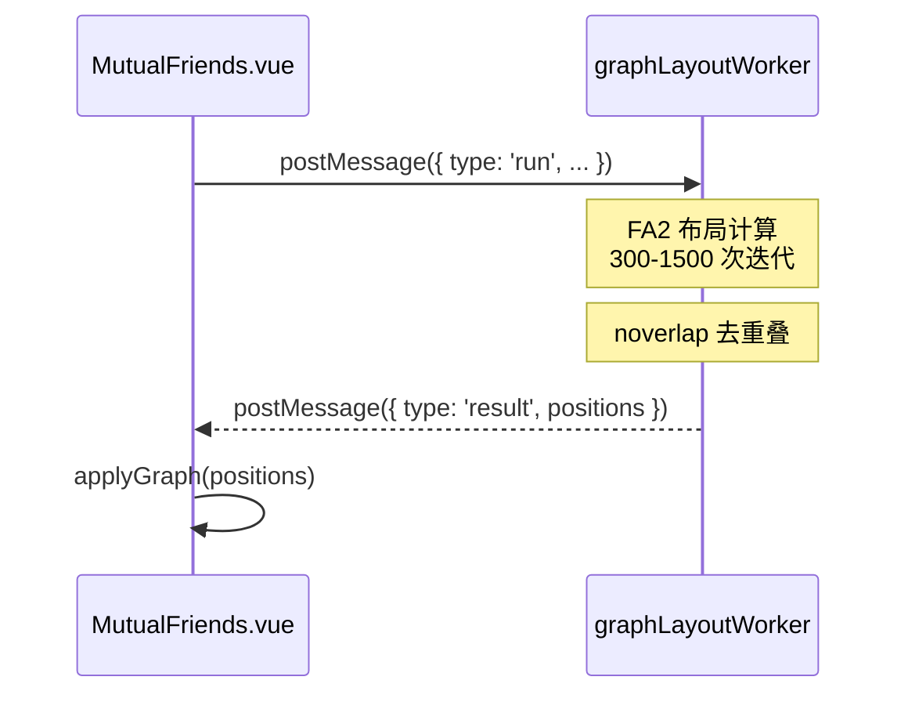
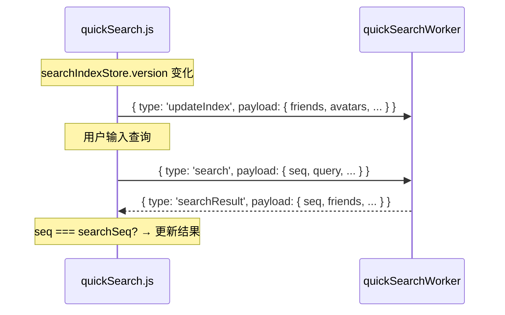

# Web Worker 架构

Web Worker 系统将 CPU 密集型计算（图布局、模糊搜索）卸载到专用 worker 线程，以防止 UI 阻塞。

## 概览

| Worker | 状态 | 文件 |
|--------|------|------|
| graphLayoutWorker | ✅ 已实现 | `src/workers/graphLayoutWorker.js` |
| quickSearchWorker | ✅ 已实现 | `src/stores/quickSearchWorker.js` |
| Photon Worker | 📋 待定 | 等 `photon.js` 重写时一并改造 |
| Charts Worker | 📋 可选 | 非持续性瓶颈，优先级低 |

## 已实现的 Worker

### graphLayoutWorker（图布局计算）

**问题**：`forceAtlas2.assign()` 在主线程同步执行 300-1500 次迭代，对几百个节点的图会**阻塞主线程 1-5 秒**。

**方案**：将 FA2 + noverlap 完整计算逻辑移到独立 Worker。

| 项目 | 内容 |
|------|------|
| **消息协议** | `{ type: 'run', requestId, graph, settings }` → `{ type: 'result', requestId, positions }` |
| **竞态防护** | 使用 `requestId` 防止并发调用覆盖结果 |
| **构建产物** | ~82KB |
| **收益** | 布局计算完全后台化，主线程保持 60fps |

### quickSearchWorker（快速搜索）

**问题**：`removeConfusables()`（Unicode 正规化 + Map 查找 + 正则替换）+ `localeIncludes()` 在好友 1000+ 时每次按键会卡顿。

**方案**：将搜索索引和搜索逻辑完全移到 Worker。

| 项目 | 内容 |
|------|------|
| **消息协议** | `updateIndex`（同步数据快照）+ `search`（执行搜索） |
| **竞态防护** | 使用 `searchSeq` 递增计数器，过时结果被丢弃 |
| **索引更新** | 监听 `searchIndexStore.version`，200ms debounce 后发送快照 |
| **内联依赖** | confusables 映射表内联到 Worker（避免引入非 Worker 安全的模块） |
| **构建产物** | ~6KB |
| **收益** | 搜索输入流畅，打字无卡顿 |

## 决策方向

### P2：Photon 事件解析 Worker

`photon.js`（1891 行，72KB）处理 VRChat 的 Photon 网络事件。在大房间（30-80 人）中事件量爆发时会造成微卡顿。

| 项目 | 内容 |
|------|------|
| **可行性** | 中——纯解析/数据转换可以 Worker 化，但和 18 个 store 深度耦合 |
| **改造难度** | ⭐⭐⭐ 较高 |
| **当前决策** | `photon.js` 标注了 `@deprecated`，等重写时直接设计为 Worker 架构 |

### P3：Charts 数据处理 Worker

`InstanceActivity.vue` 的 `getActivityData()` 从 DB 拉取数据后做大量数据变换（dayjs 解析、分组、排序）。

| 项目 | 内容 |
|------|------|
| **可行性** | 高——数据处理是纯函数 |
| **改造难度** | ⭐⭐ 中等 |
| **当前决策** | 只在首次加载/切换日期时触发，非持续性瓶颈，可选优化 |

### 不适合 Worker 的模块

| 模块 | 原因 |
|------|------|
| **WebSocket 消息处理** (`websocket.js`) | 需要直接更新 Pinia store，Worker 无法访问 Vue 响应式系统 |
| **更新循环** (`updateLoop.js`) | 需要调用 `AppApi`、`LogWatcher` 等主线程绑定对象 |
| **GameLog 处理** (`gameLogCoordinator.js`) | 每条日志处理后立即需要更新多个 store，分离成本 > 收益 |
| **数据库查询** (`sqlite.js`) | SQLite 调用走 `window.SQLite`（C#/Electron 绑定），Worker 无法访问 window 对象 |
