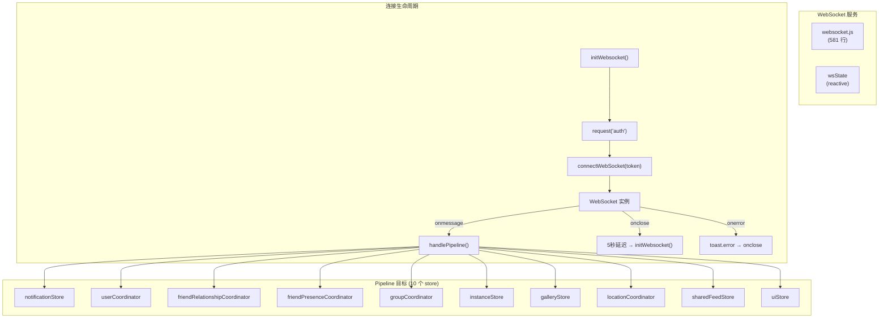

# WebSocket 服务

## 概述

WebSocket 服务（`services/websocket.js`）是 VRCX 的实时事件管线。它维护与 VRChat 服务器的持久 WebSocket 连接，并将传入事件分发到相应的 store 和 coordinator。它是应用中**唯一**的实时数据源 — 所有其他数据流都是基于轮询的。



## 响应式状态

```js
export const wsState = reactive({
    connected: false,      // WebSocket 当前是否连接
    messageCount: 0,       // 接收的消息总数（用于速率计算）
    bytesReceived: 0       // 接收的总字节数
});
```

此状态被 `StatusBar.vue` 消费，用于 WebSocket 指示器和消息频率火花图。

## 连接生命周期

### 初始化

```js
export function initWebsocket() {
    // 守卫：仅在好友加载完成且无现有 socket 时连接
    if (!watchState.isFriendsLoaded || webSocket !== null) return;

    // 1. 从 VRC API 请求认证令牌
    request('auth', { method: 'GET' })
        .then((json) => {
            if (json.ok) connectWebSocket(json.token);
        });
}
```

**触发：** `initWebsocket()` 从 `authStore` 对 `watchState.isFriendsLoaded` 的 watcher 中调用。仅在登录完成且好友列表完全同步后才触发。

### 重连策略

- 关闭时：5 秒延迟，然后重新认证并重连
- 守卫：仅在仍然登录、好友已加载且无现有 socket 时重连
- 错误时：视为异常关闭（code 1006），触发相同重连路径
- **无指数退避** — 5 秒固定延迟

### 去重

```js
let lastWebSocketMessage = '';

// 跳过完全相同的连续消息
// VRChat 有时会发送重复消息
if (lastWebSocketMessage === data) return;
```

## Pipeline 事件类型

### 通知事件

| 类型 | 处理器 | 用途 |
|------|--------|------|
| `notification` | `handleNotification` + `handlePipelineNotification` | V1 通知 |
| `notification-v2` | `handleNotificationV2` | V2 通知 |
| `notification-v2-delete` | `handleNotificationV2Hide` + `handleNotificationSee` | V2 删除 |
| `notification-v2-update` | `handleNotificationV2Update` | V2 更新 |
| `see-notification` | `handleNotificationSee` | 标记已读 |
| `hide-notification` | `handleNotificationHide` + `handleNotificationSee` | 隐藏 |
| `response-notification` | `handleNotificationHide` + `handleNotificationSee` | 回复 |

### 好友事件

| 类型 | 处理器 | 用途 |
|------|--------|------|
| `friend-add` | `applyUser` + `handleFriendAdd` | 新增好友 |
| `friend-delete` | `handleFriendDelete` | 删除好友 |
| `friend-online` | `applyUser`（合并位置数据） | 好友上线 |
| `friend-active` | `applyUser`（state='active'） | 好友变为活跃 |
| `friend-offline` | `applyUser`（state='offline'） | 好友下线 |
| `friend-update` | `applyUser` | 好友数据变更 |
| `friend-location` | `applyUser`（合并位置数据） | 好友位置变更 |

### 用户/群组/实例/内容事件

| 类型 | 处理器 | 用途 |
|------|--------|------|
| `user-update` | `applyCurrentUser` | 当前用户数据变更 |
| `user-location` | `runSetCurrentUserLocationFlow` | 当前用户位置变更 |
| `group-left` | `onGroupLeft` | 离开群组 |
| `group-role-updated` | `getGroup` + `applyGroup` | 角色权限变更 |
| `group-member-updated` | `getGroupDialogGroup` + `handleGroupMember` | 成员数据变更 |
| `instance-queue-*` | `instanceStore` 方法 | 实例队列状态 |
| `instance-closed` | 通知 + feed 条目 | 实例关闭 |
| `content-refresh` | 条件性 gallery 刷新 | 内容类型更新 |

## 外部 API

| 函数 | 用途 | 调用者 |
|------|------|--------|
| `initWebsocket()` | 启动连接 | `authStore`（好友加载后） |
| `closeWebSocket()` | 终止连接 | `authCoordinator.runLogoutFlow()` |
| `reconnectWebSocket()` | 强制重连 | 手动触发 |
| `wsState` | 响应式遥测 | `StatusBar.vue` |

## 文件映射

| 文件 | 行数 | 用途 |
|------|------|------|
| `services/websocket.js` | 581 | 连接管理、pipeline 分发 |

## 风险与注意事项

- **单一 `lastWebSocketMessage` 去重**只捕获连续重复。非连续重复会被处理两次。
- **Pipeline switch 语句**超过 350 行。每个 case 直接访问 store — 没有中间事件总线或队列。
- **`friend-online`/`friend-location` 事件**的数据形状不一致（有时 `content.user` 缺失）。Pipeline 有兜底处理但会记录错误。
- **`content.user.state` 被删除** — VRChat 在用户对象中发送过时的 state。
- **重连无指数退避。** 5 秒固定延迟可能在 VRC API 故障期间导致快速重连尝试。
- **使用 `workerTimers.setTimeout`** 而非原生 `setTimeout` 以避免浏览器对后台标签的节流。
